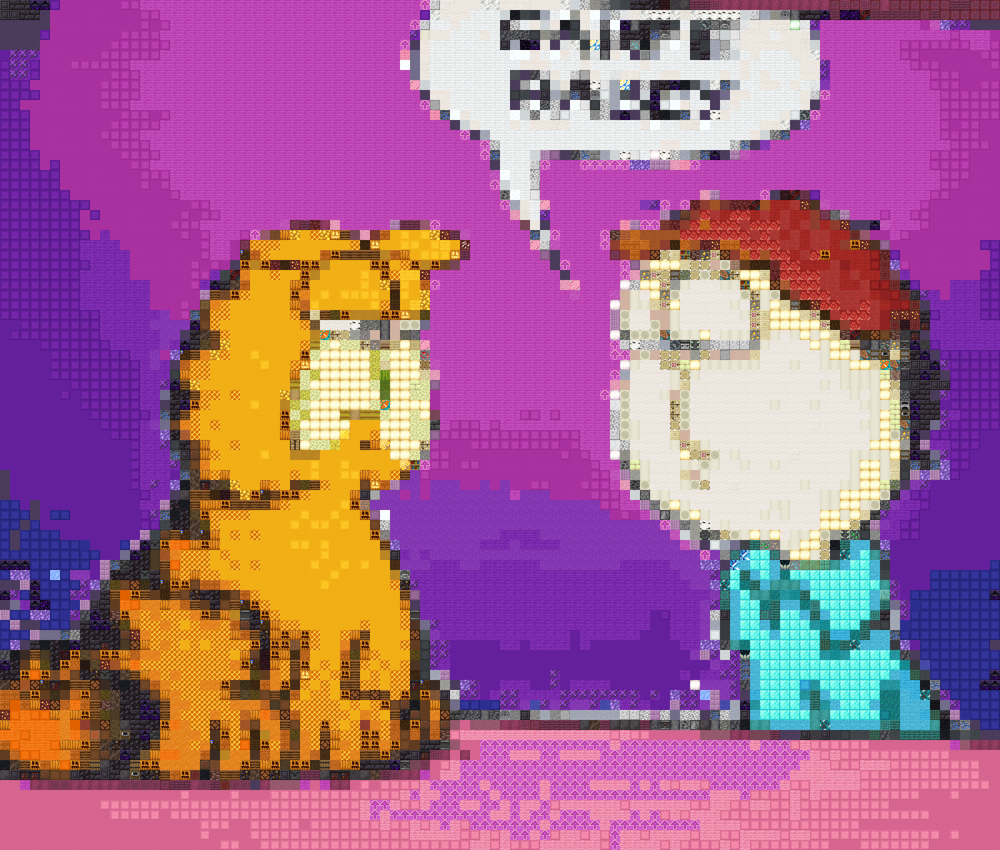

# McImg

Convert an image into Minecraft blocks.

Made with Rust, [`image`](https://crates.io/crates/image), and [`clap`](https://crates.io/crates/clap).

[Latest Release](https://github.com/darccyy/mcimg/releases/latest)

```
Usage: mcimg.exe [OPTIONS] <INPUT>

Arguments:
  <INPUT>  Path of image to convert

Options:
  -o, --output <OUTPUT>        Path of image to output [default: ./mcimg.png]
  -w, --width <WIDTH>          Width of output image, in pixels [default: 100]
  -t, --textures <TEXTURES>    Path of textures directory [default: ./textures]
  -b, --blacklist <BLACKLIST>  Path of file of blacklisted blocks Use `-` to ignore (default) [default: -]
  -m, --materials <MATERIALS>  Path of file of required materials Use `-` to ignore (default) [default: -]
  -h, --help                   Print help information
  -V, --version                Print version information
```

Example image:



# Contributing

Build release with `just build`

# Todo

## Features

- Add case for transparent pixels in input image
- Convert materials list to blocks, not textures
- Add filter type to cli args ?

## Improvements

- Add error handling
- Add more/better tests
- Make doc comments better
- Add instructions to readme
- Cache block map ? probably not an issue as it is really fast to process
